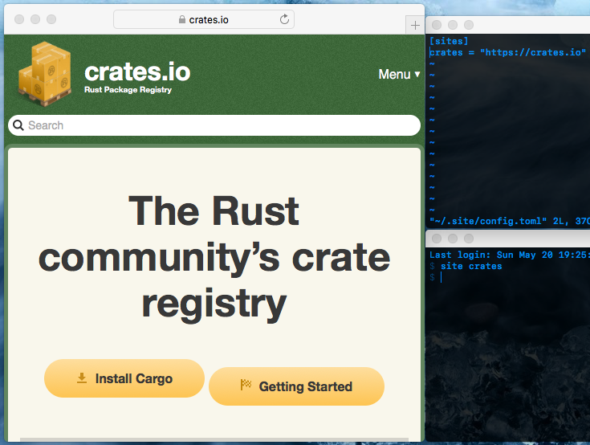

# Site
A command line bookmark manager

## Purpose
The purpose of the app is to access website bookmarks from the command line. I felt it took to much time to fire up safari, open up the bookmarks page, search for the bookmark I'm looking for, then use the bookmark. I just wanted all my bookmarks to be in a simple configuration file that my app can access.

## Environment
* **MacOS** - version 10.13.6
* **Rust** - version 1.27.2

## Installation
1. Make sure you have the latest rust tools installed
2. Clone or download the repo
3. `$ cd site`
4. `$ cargo build --release`
5. Binary is located in `site/target/release/site`

## Usage
* Usage: site [FLAGS] [KEY]
* Help: `site --help` for up to date information
* Key = the key used to access the stored url

## Examples
* `site wiki`
* `site --edit`

## Design
The design is simple. Bookmarks are stored in a TOML file which can be edited to add, remove, and modify bookmarks. The command to open the URLs is the macOS `open` command. 

## Notes
As of now the command line app is not portable due to the `open` command only working in macOS. Also there is one simple issue where the default TOML file needs to be edited to add the following at the top: `[sites]`. My next release should fix the default TOML file issue. For now please see the example screenshot to see how the TOML file should be written. 